# Hi, I'm Samarth 👋

---

## 👨‍💻 About Me

I enjoy building projects that challenge me and teach me something new.

I am exploring AI, backend development and full-stack applications—trying to turn ideas into working software rather than leaving them as concepts.

Every repository here represents a problem I wanted to solve, a technology I wanted to learn or an experiment that helped me grow as a developer.

---

## 🚀 What I'm Building

- 🤖 AI Agents & Multi-Agent Systems
- 🧠 Retrieval-Augmented Generation (RAG)
- 🌐 Full-Stack Applications
- ⚙️ Intelligent Automation
- ☁️ Scalable Backend Systems

---

## 🤝 Let's Connect

<a href="https://www.linkedin.com/in/samarthkumbhar144/">LinkedIn</a> •
<a href="https://leetcode.com/u/Samarth_144/">LeetCode</a>

---

## 📊 GitHub Stats

---

## 🔥 GitHub Streak

---

*"Ideas are cheap. Building them isn't."*

